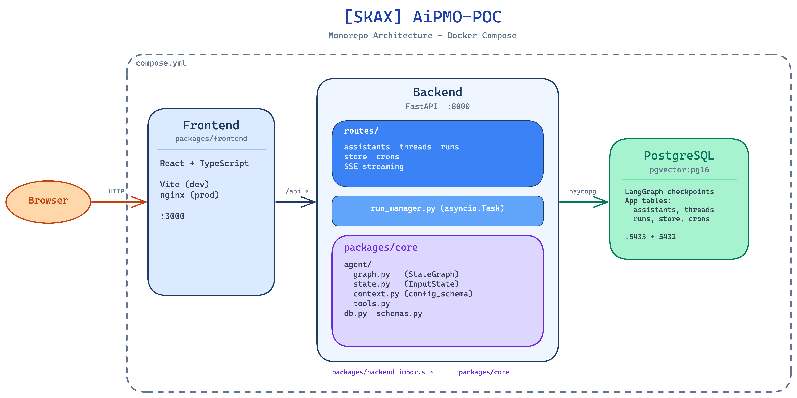

# langgraph-fastapi-boilerplate

LangGraph Platform API를 벤더 종속 없이 구현한 풀스택 보일러플레이트.

## Architecture



## Tech Stack

| Layer | Stack |
|-------|-------|
| **Frontend** | React + TypeScript, Vite (dev), nginx (prod) |
| **Backend** | FastAPI, SSE streaming, asyncio task manager |
| **Core** | LangGraph (StateGraph), LangChain, psycopg |
| **Database** | PostgreSQL (pgvector:pg16) |
| **Infra** | Docker Compose, uv workspaces |

## Project Structure

```
├── packages/
│   ├── core/           # LangGraph agent, DB operations, schemas
│   ├── backend/        # FastAPI server (routes, run_manager)
│   └── frontend/       # React + Vite + TypeScript
├── tests/
│   ├── unit_tests/
│   └── integration_tests/
├── compose.yml
├── Makefile
└── pyproject.toml      # uv workspace root
```

## Quick Start

```bash
# 1. 환경 설정
cp .env.example .env
# .env에 ANTHROPIC_API_KEY 입력

# 2. 의존성 설치
uv sync

# 3. Docker 실행
make up

# 4. 확인
curl http://localhost:8000/health
```

## Development

```bash
make dev          # Backend (FastAPI :8000)
make dev-front    # Frontend (Vite :3000)
make test         # Unit tests
make test-int     # Integration tests
make lint         # Ruff lint
make format       # Ruff format
```

## API Endpoints

LangGraph Platform API 호환:

- `POST /assistants` — Assistant CRUD + search
- `POST /threads` — Thread CRUD + state/history
- `POST /threads/{id}/runs` — Run create/stream/wait/cancel/join
- `PUT /store/items` — Key-value store
- `POST /crons` — Cron job management
- `GET /health` — Health check
- `GET /info` — Server info
